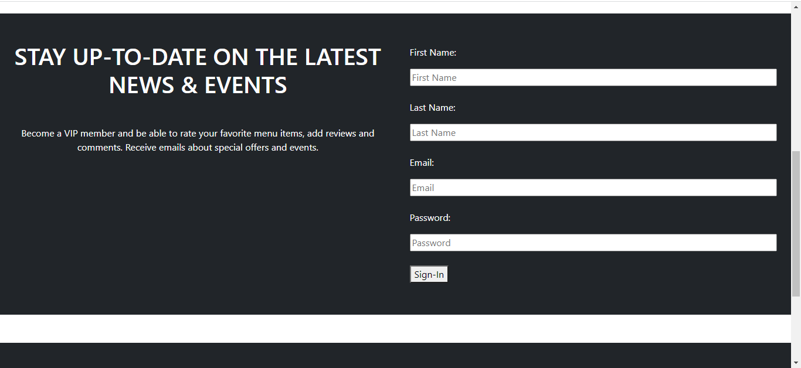

# NowThatsAWrap

## Task

With our team, We work with our group to build a performant and scalable MERN stack single-page application that fulfills a real-world need, with a focus on data and user demand. In creating our collaborative application, we combine a scalable MongoDB back end and an Express.js and Node.js server with a React front end, implementing user authentication with JWT to build a user-focused platform. We continue to build on the agile development methodologies we’ve used throughout this course, like storing our project code in GitHub, managing our work with a project management tool, and implementing feature and bug fixes using the Git branch workflow and pull requests.


## User Story

```md
WHEN you click on the deployed link that will open about page for restaurant app
WHEN I click on Menu 
THEN I see the Menu for  restaurant 
WHEN I click on single Menu item 
THEN I can see that single menu item with review and description of that menu item.
WHEN I clicked review 
THEN I see the reviews for that menu item and back to menu button
WHEN I click back button Then I see the menu page with menu items
WHEN I click on Contact Us, Online Order, VIP Members, Private Events, Catering Events
THEN I am directed to that respective page of the app 
WHEN I am on Private Events, Catering Events, Contact Us, VIP Members page
THEN I find respective form for contact/order/event
```

## Description

 

 This is a MERN-stack web application. Our team design and build an application using the MVC paradigm, with own server-side API, added user authentication and connect it to a database.

## Screenshot




## Key Topics

The following topics will be covered in this project:

* Full-stack applications

* [Git branching workflow](https://git-scm.com/book/en/v2/Git-Branching-Branching-Workflows)

* [Agile software development](https://en.wikipedia.org/wiki/Agile_software_development)

* Collaborative development

## In this Project 

* We use React for the front end.

* We use Node.js and Express.js to create a RESTful API.

* We will Include authentication (JWT) for VIP Member.

* We use MongoDB for the database.

* Have both GET and POST routes for retrieving and adding new Reviews for Menu. 
  As well PUT and DELETE routes for update and delete reviews.

* We Use one new package mdbreact and mdb-react-ui-kit that we haven’t discussed in BootCamp class.

* Our app is responsive.

* Our app Have a polished UI.

* Be deployed using Heroku (with data).

## Table Of Contents

- [Installation](#installation)
- [Usage](#usage)
- [Test](#test)
- [License](#license)
- [Contribution](#contribution)
- [Contact](#contact)
- [Questions](#questions)
    
## Installation 

The following necessary dependencies must be installed to run the application.

  For this application user needs to install below dependencies : node.js, express.js, concurrently, MongoDB, bootstrap, bcrypt, react, react-carousel, dotenv, react-dom, react-scripts, react-router-dom, react-bootstrap, mdbreact, mdb-react-ui-kit, mongoose, react-icons, axios

## Usage

 An user can run the application with npm run develop command in terminal, or an user can visit deployed web application.

## Test
N/A

## License

This project is licensed under :

 [MIT](https://opensource.org/licenses/MIT)

For more information about the license, check the above link.

## Contribution

Tammy Gagliano, Dwight Kogunberg, Tom lazore, Landrell Williams and Bindubahen Vaghela

## Contact

* GitHub :[NowThatsAWrap](https://github.com/DeeScrump/NowThatsAWrap)

* Email : tracsd@gmail.com(Tammy), tomlazore@gmail.com(Tom), dontess5@yahoo.com(Dwight), bindi.vaghela@gmail.com(Bindu)
    
## Questions

If you have any questions, please reach out to our Github,

* [NowThatsAWrap](https://github.com/DeeScrump/NowThatsAWrap)

## Presentation Link

* [The URL of the deployed application](https://nowthatsawrap.herokuapp.com/)

* [The URL of the GitHub repository](https://github.com/DeeScrump/NowThatsAWrap)

#### Thank you for visiting our Github!
